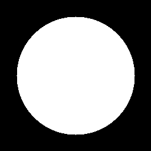
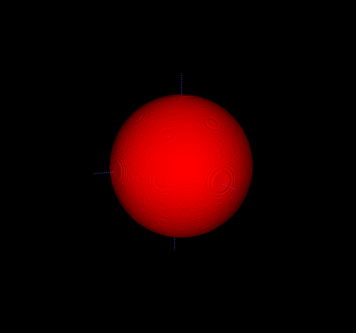

# Simple example code for generating synthetic sphere data

The code can be used for generating n-dimensional sphere masks, that may be useful for unit testing.
It has been optimised using numpy's matrix/vector operations, and hence can be quite fast to generate high-dimensional data.

## Example usage

### Generate 2D data

```python
save(opt_sphere(100, 256, 2), "data/out")
```



### Generate 3D data

```python
save(opt_sphere(100, 256, 3), "data/out")

```


## Timing for test code
Running the following python function
```python
test_functions()
```


```
nDims: 2 | Radius: 10 | size: 500
Unopt time: 0.9560749530792236
Opt time: 0.0043718814849853516

nDims: 2 | Radius: 250 | size: 500
Unopt time: 0.988438606262207
Opt time: 0.003949165344238281

nDims: 3 | Radius: 10 | size: 100
Unopt time: 3.9963746070861816
Opt time: 0.013117790222167969

nDims: 3 | Radius: 100 | size: 256
Unopt time: 68.46678805351257
Opt time: 0.23948001861572266

```
